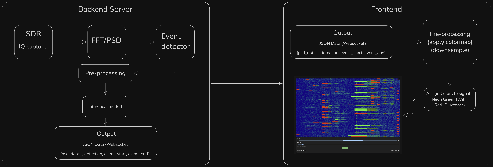

# RF Signal Classifier: WiFi vs. Bluetooth  
**Comprehensive Project Documentation**

---

## 1. Statement of Work

This project, developed by students at **Virginia Commonwealth University (VCU)** and sponsored by Vectrus V2X, addresses the urgent need for automated identification and classification of radio frequency (RF) signals in increasingly crowded electromagnetic environments. The primary objective is to leverage machine learning to distinguish between WiFi and Bluetooth signals—two of the most prevalent sources of spectrum congestion—thereby supporting more efficient and reliable communications for organizations such as the U.S. Navy.

Manual RF signal analysis is time-consuming and prone to human error, especially in mission-critical scenarios. By automating this process, the project aims to enhance the speed and accuracy of RF spectrum sensing, reduce operator workload, and improve operational resilience against threats like jamming or spoofing.

The system is designed to:
- Capture RF signals in the 2.4 GHz band using software-defined radio (SDR) hardware.
- Convert raw IQ data into frequency-domain representations using FFT.
- Extract features suitable for machine learning classification.
- Train a model to classify signals as WiFi, Bluetooth, or neither.
- Provide a documented, deployable solution for real-world use and future research.

The final deliverable will be a complete system—integrating data collection, signal processing, machine learning, and user documentation—ready for handoff to Vectrus V2X and applicable to both military and civilian spectrum monitoring needs.

---

## 2. Architecture

 

*This section will be expanded as the system design matures.*

**Planned High-Level Architecture:**
- **Signal Acquisition:** SDR hardware (e.g., USRP B210, RTL-SDR V3) captures RF signals.
- **Data Processing Pipeline:** Python-based application processes raw data, performs FFT, and extracts features.
- **Machine Learning Module:** Trained models (e.g., LightGBM) classify signals as WiFi, Bluetooth, or neither.
- **Deployment/Interface:** Command-line tools for training and inference; potential for integration with other systems or user interfaces.

Components will be distributed across data acquisition hardware, processing servers, and user endpoints as appropriate for the deployment scenario.

---

## 3. Detailed Design

The system is organized into modular Python components, each responsible for a specific stage of the pipeline:

- **Data Loader:** Reads PSD data from HDF5 files, assigns labels, and prepares data for processing.
- **Preprocessing:** Detects signal events, masks noise, and calculates event widths to focus on relevant signal regions.
- **Feature Extraction:** Computes spectral and bandwidth-related features from the processed data, using parallel processing for efficiency.
- **Model Trainer:** Trains and evaluates the machine learning classifier, applying heuristics to refine predictions.
- **Output Generator:** Saves trained models, performance metrics, and visualizations for analysis and deployment.
- **Classifier Module:** Provides a deployable class for real-time or batch inference on new data.

**Data Flow:**
1. **Acquisition:** SDR captures RF data.
2. **Loading:** Data is read and labeled.
3. **Preprocessing:** Events are detected and signals are masked.
4. **Feature Extraction:** Features are computed for each event.
5. **Training/Evaluation:** Model is trained and tested.
6. **Deployment:** Model and supporting files are saved for future use.

---

## 4. Installation Guide

### Prerequisites
- Python 3.8 or newer
- [UV](https://github.com/astral-sh/uv) for dependency management
- HDF5 data file containing PSD samples (with appropriate key naming)

### Installation Steps
1. **Install UV (if not already installed):**
    ```bash
    pip install uv
    ```
2. **Install project dependencies:**
    ```bash
    uv sync
    ```
3. **Prepare your data:**
    - Place your HDF5 file (e.g., `dataset.h5`) in the `./data/` directory.
    - Ensure keys are named to indicate signal type (e.g., `wifi_*`, `bluetooth_*`).

4. **Configure the pipeline:**
    - Edit `data_path` and `feature_method` in `MLRF_1.5.py` as needed for your setup.

### Running the Pipeline
```bash
uv run MLRF_1.5.py
```

### Troubleshooting
- Verify all dependencies are installed.
- Check that your data file is in the correct format and location.
- Review error messages for missing files or misconfigurations.

---

## 5. User Guide

### Running the Classifier
1. Ensure your data is prepared and dependencies are installed.
2. Run the main script:
    ```bash
    uv run MLRF_1.5.py
    ```
3. The script will output:
    - A trained model file (`lightgbm_model_*.joblib`)
    - A confusion matrix plot (`confusion_matrix_*.png`)
    - A metadata file (`model_metadata_*.json`)

### Customization
- **Feature Extraction:** Change the `feature_method` variable in `MLRF_1.5.py` to select between spectral, bandwidth, or combined features.
- **Model Parameters:** Adjust LightGBM hyperparameters in `MLRF/model_trainer.py`.
- **Data Path:** Update `data_path` in `MLRF_1.5.py` if your data is stored elsewhere.

### Using the Classifier for Inference
- Import the `RFClassifier` class for predictions on new PSD data:
    ```python
    from MLRF.classifier import RFClassifier

    clf = RFClassifier(model_path='lightgbm_model_*.joblib')
    prediction = clf.predict(psd_sample)
    probability = clf.predict_proba(psd_sample)
    ```

### Output Interpretation
- **Model File:** Use for future predictions or deployment.
- **Confusion Matrix:** Visualizes classification performance.
- **Metadata:** Contains run details, feature importances, and metrics.

